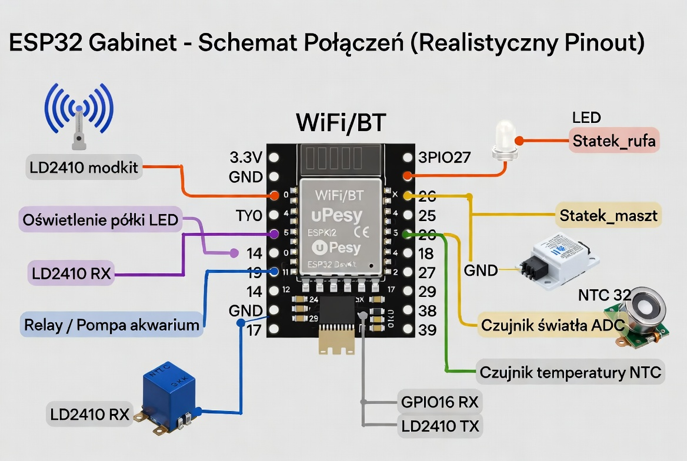

# 🏠 ESPHome Gabinet – Inteligentne Oświetlenie i Czujniki

Projekt **ESPHome** dla gabinetu – zaawansowane sterowanie oświetleniem LED , detekcja obecności za pomocą radaru **LD2410**, pomiar temperatury akwarium oraz automatyczne oświetlenie nocne.

---

## ✨ Główne Funkcje

- **Efektowne oświetlenie LED** – dwa niezależne kanały: „Statek_rufa” i „Statek_maszt” z wieloma efektami
- **Radar LD2410** – precyzyjna detekcja obecności człowieka (ruch + obecność statyczna)
- **Automatyczne oświetlenie nocne** – włącza się tylko po zmroku przy wykryciu osoby
- **Pomiar natężenia światła** – skalibrowany czujnik ADC z krzywą polynomialną
- **Temperatura akwarium** – pomiar NTC z filtrowaniem
- **Bluetooth Proxy** – pomaga w zasięgu urządzeń BLE w Home Assistant
- **Bezpieczne pomiary** – włączanie pompy/czujnika tylko na czas pomiaru

---

## 🛠️ Sprzęt

| Element                  | Pin ESP32     | Opis |
|--------------------------|---------------|------|
| **LED Rufa**             | GPIO27        | Oświetlenie LED (monochromatic) |
| **LED Maszt**            | GPIO26        | Oświetlenie LED (monochromatic) |
| **Czujnik światła**      | GPIO32        | ADC – natężenie oświetlenia (lx) |
| **Czujnik temperatury**  | GPIO35        | ADC → Resistance → NTC (akwarium) |
| **LD2410 RX**            | GPIO16        | Radar – odbiór danych |
| **LD2410 TX**            | GPIO17        | Radar – nadawanie |
| **Włącznik Akwarium**    | GPIO19        | Załącza czujnik na czas pomiaru |
| **Oświetlenie półki**    | GPIO14        | Dodatkowe oświetlenie LED |
| **Czujnik szarości**     | GPIO05        | Wejście binarne |

**Zasilanie:**
- Wszystkie moduły zasilane **3.3V** lub **5V** (zależnie od specyfikacji)
- LD2410 zwykle 5V, ale komunikacja 3.3V (tolerancyjny)
---

### Schemat Połączeń (Realistyczny)

# 🎮  Dostępne Efekty Oświetlenia
## Statek_rufa & Statek_maszt

Wolne Przyciemnianie – płynne pulsowanie co 10s
Szybkie miganie – dynamiczny efekt
Efekt losowy – chaotyczne zmiany
Migotanie – subtelny efekt „świeczki”

# 🤖 Automatyzacje

Po zachodzie słońca (sun.is_below_horizon):
Przy wykryciu osoby (presence_cz) → włącza oba światła na 60% jasności

Przy wschodzie słońca → wyłącza światła
Brak osoby → światła zawsze wyłączone (oszczędność energii)

# 📡 Dodatkowe Możliwości

Bluetooth Proxy – 3 sloty połączeń, aktywny skan co ~1,1s
LD2410 – pełna konfiguracja bramek, progów energii, timeoutu
Kalibracja światła – polynomial degree 2 na podstawie rzeczywistych pomiarów

# 🚀 Instalacja

Skopiuj pliki do ESPHome
Uzupełnij secrets.yaml (WiFi, lokalizacja, klucz szyfrowania)
Skompiluj i wgraj
Dodaj urządzenie do Home Assistant