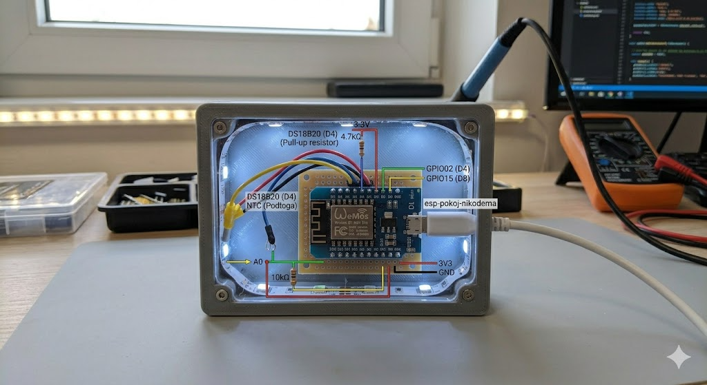

# 🏠 ESP8266 Smart Temperature Monitor (NTC + Dallas)

Projekt zaawansowanego kontrolera temperatury opartego na układzie **ESP8266**, zintegrowanego z systemem **Home Assistant** poprzez **ESPHome**. System monitoruje temperaturę pomieszczenia oraz temperaturę podłogi, wykorzystując optymalizację zużycia energii i precyzyjne filtrowanie danych.

## 🛠️ Kluczowe Funkcje
- **Podwójny pomiar temperatury**:
  - **Pokój**: Cyfrowy czujnik DS18B20 (precyzja i stabilność).
  - **Podłoga**: Termistor NTC 10K (analogowy).
- **Kluczowanie zasilania NTC**: Termistor jest zasilany przez GPIO12 tylko na czas pomiaru. Zapobiega to samonagrzewaniu się czujnika i błędnym odczytom.
- **Zaawansowane filtrowanie**: 
  - Filtr medianowy (`window_size: 7`) eliminuje nagłe piki i szumy elektryczne z odczytów analogowych.
- **Diagnostyka WiFi**: Monitorowanie siły sygnału wyrażone w dBm oraz procentach (%).

## 📐 Schemat Połączeń i Piny

| Komponent | Pin ESP8266 | Opis |
| :--- | :--- | :--- |
| **DS18B20** | `GPIO15` | Czujnik pokojowy (magistrala OneWire) |
| **NTC 10K (VCC)** | `GPIO02` | Sterowanie zasilaniem dzielnika (Switch) |
| **NTC 10K (Data)** | `A0` | Odczyt napięcia z dzielnika |
| **Rezystor 10kΩ** | `A0` -> `GND` | Rezystor odniesienia (Konfiguracja DOWNSTREAM) |

  
### Diagram Połączeń ESPHome 

```text
               +-----------------------------------+
               |          WEMOS D1 MINI            |
               |                                   |
               |    [3V3]   [GND]   [D4]   [A0]    |   [D2]
               +------+-------+------+------+------+----+
                      |       |      |      |           |
                      |       |      |      |           |
                      |       |      |      |           |
    +-----------------+       |      |      |           |
    |                         |      |      |           |
 [Rezystor]                   |      |      |           |
  4.7 kOhm                    |      |      |           |
    |                         |      |      |           |
    +-------------------------|------+      |           |
    |                         |             |           |
+---+---+                     |             |           |
| VCC   |                     |             |           |
| DATA  +---------------------+             |           |
| GND   +---------------------+             |           |
+-------+                                   |           |
Czujnik DALLAS                              |           |
(np. DS18B20)                               |           |
                                            |           |
                                            |           |
                         +------------------+           |
                         |                              |
                         |                              |
                   +-----+-----+                  +-----+-----+
                   | Rezystor  |                  |    NTC    |
                   |  10 kOhm  |                  | Termistor |
                   +-----+-----+                  +-----+-----+
                         |                              |
                         +---------------+--------------+
                                         |
                                         |
                                       [GND] 
```
                                       


## 💻 Logika Pracy (Automation)
Urządzenie nie wykonuje pomiarów w trybie ciągłym, co wydłuża żywotność komponentów. Co **30 sekund** wykonywana jest następująca sekwencja:
1. Aktywacja pinu `GPIO12` (podanie zasilania na dzielnik NTC).
2. Odczyt wartości z pinu analogowego `A0`.
3. Przeliczenie napięcia na oporność, a następnie na temperaturę (B-constant: 3950).
4. Dezaktywacja pinu `GPIO12`.

## 🚀 Instalacja
1. Skopiuj repozytorium do swojego folderu ESPHome.
2. Utwórz plik `secrets.yaml` i uzupełnij dane dostępowe:
   ```yaml
   wifi_ssid: "Twoje_WiFi"
   wifi_password: "Twoje_Haslo"
   ap_ssid: "ESP_Fallback_Hotspot"
   ap_password: "Haslo_Ratunkowe"

## 📊 Konfiguracja w Home Assistant
Po poprawnym wgraniu kodu, Home Assistant automatycznie wykryje nowe urządzenie. 
Encje, które pojawią się w systemie:
* `sensor.temperatura_podlogi_ntc`
* `sensor.temperatura_w_pomieszczeniu_dallas`
* `sensor.wifi_signal_strength`

---
**Autor:** [Marcin162](https://github.com/Marcin162)  
**Licencja:** MIT